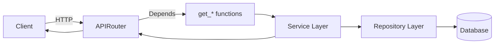
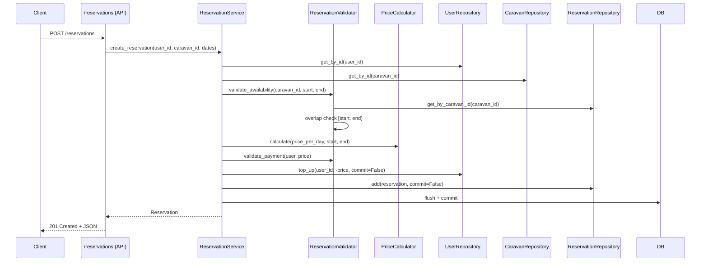

## 1. 아키텍처 선정 배경 (Architecture Decision)

### Layered Architecture 채택

이 프로젝트는 전형적인 레이어드 아키텍처를 사용합니다.

- `src/api` – HTTP 입출력, 인증/인가, 예외 → HTTP 상태 코드 매핑
- `src/services` – 도메인 규칙, 트랜잭션 경계, 상태 전이
- `src/repositories` – DB 접근 캡슐화 (Repository 패턴)
- `src/models` – 영속 모델(SQLAlchemy)
- `src/exceptions` – 도메인 예외 정의

단순한 “라우터 + ORM” 구조 대신 레이어를 나눈 이유는 다음과 같습니다.

- **관심사 분리**  
  - 라우터는 FastAPI/HTTP concern (경로, 인증, 응답 코드)에만 집중합니다.  
  - 서비스는 “카라반 예약 비즈니스 규칙과 트랜잭션”에만 집중합니다.  
  - 레포지토리는 “어떤 SQL/ORM 쿼리를 사용해 데이터를 가져올지”에만 집중합니다.
- **비즈니스 로직 격리**  
  - 예약 생성/취소/상태 전이, 잔액 차감/환불과 같은 핵심 규칙은 `ReservationService`, `ReservationValidator`, `UserService` 에 모여 있습니다.  
  - 이 레이어는 FastAPI와 독립적으로 테스트할 수 있고, 프레임워크 교체 시에도 재사용 가능하도록 설계했습니다.
- **테스트 용이성**  
  - API 레벨 테스트는 `backend/tests` 에서 전체 흐름을 검증하고,  
  - 서비스/레포지토리는 독립적으로 인스턴스화할 수 있도록 의존성을 명시적으로 전달합니다.

### 요청–응답 데이터 플로우

메인 요청 흐름은 다음과 같습니다.

예약 생성의 구체적인 흐름을 예로 들면:

HTTP 계층은 가능한 한 얇게 유지하고, **실질적인 비즈니스 의사결정은 서비스/검증기 레이어에서 수행**되도록 설계한 것이 핵심입니다.

---

## 2. 도메인 모델링과 비즈니스 로직 (Domain & Logic)

### 카라반 공유 도메인 모델링

도메인 모델은 “카라반 공유 플랫폼”이라는 컨텍스트를 반영합니다.

- `User` + `UserRole` (`guest`, `host`, `admin`)  
  - 게스트: 예약 생성 가능  
  - 호스트: 자신의 카라반과 그에 대한 예약 관리  
  - 관리자: 전체 예약 조회 및 유저 관리(승격, 잔액 조정 등)
- `Caravan` + `CaravanStatus` (`available`, `reserved`, `maintenance`)  
  - 물리적 자원(카라반) 상태를 표현하는 별도의 Enum 필드로, 향후 운영/정비 시나리오를 확장할 여지를 남겨두었습니다.
- `Reservation` + `ReservationStatus` (`pending`, `confirmed`, `cancelled`)  
  - 예약의 라이프사이클을 명시적으로 모델링하여, 상태 전이 규칙을 코드 수준에서 관리할 수 있게 했습니다.

### Double Booking 방지 전략 (Concurrency / Overbooking)

이 시스템에서 가장 중요한 도메인 제약은 “동일 카라반이 같은 기간에 중복 예약되지 않아야 한다”는 것입니다. 이를 위해 다음과 같은 다단계 방지 전략을 사용합니다.

1. **시간 구간 모델링**
   - 예약 기간은 `[start_date, end_date)` 구간으로 정의합니다.  
   - `ReservationValidator.validate_availability` 에서 이 규칙을 기준으로 시간 구간 겹침을 검사합니다.

2. **애플리케이션 레벨의 Overlap 체크**
   - `ReservationRepository.get_by_caravan_id(caravan_id)` 로 해당 카라반의 모든 예약을 가져온 뒤,
   - `(start < existing.end) and (end > existing.start)` 조건을 만족하는지 루프를 돌며 검사합니다.
   - 겹침이 발견되면 즉시 `DuplicateReservationError` 를 발생시켜 상위 레이어에 전달합니다.

3. **DB 인덱스와 읽기 패턴**
   - `Reservation` 테이블에는 `(caravan_id, start_date, end_date)` 인덱스를 두어,  
     같은 카라반에 대한 기간 검색이 전 테이블 스캔이 되지 않도록 했습니다.
   - 현재 구현은 단순 `get_by_caravan_id` 후 파이썬 루프(O(n)) 방식이지만,  
     인덱싱과 도메인 규모를 고려하면 교육/과제 수준에서는 충분한 trade-off 입니다.

4. **트랜잭션 경계에서의 일관성**
   - `ReservationService.create_reservation` 은 **하나의 DB 세션 안에서** 다음 작업을 수행합니다.
     - 잔액 차감 (`UserRepository.top_up(..., commit=False)`)
     - 예약 레코드 생성 (`ReservationRepository.add(..., commit=False)`)
     - `session.flush()` → `session.commit()`  
   - 중간에 예외가 발생하면 `rollback()` 으로 두 작업을 함께 되돌립니다.
   - 이렇게 해서 “돈은 빠졌는데 예약이 안 생긴” 혹은 그 반대 상황을 방지합니다.

실제 프로덕션 수준의 고부하 환경에서는 **DB 레벨의 unique constraint + 행 잠금/격리 수준 조정**까지 고려해야 하지만,  
이번 구현은 교육 과제/단일 인스턴스 환경을 전제로 **읽기 기반의 Overlap 체크 + 트랜잭션 일관성 확보**라는 현실적인 타협을 선택했습니다.

### 상태 관리 (Reservation / Caravan)

상태 관리는 **예약 상태를 중심으로** 처리합니다.

- `ReservationStatus` 상태 전이는 `ReservationService.update_status_by_host` 에서 관리합니다.
  - CANCELLED 는 종단 상태로, 다른 상태로 변경할 수 없습니다.
  - PENDING → {CONFIRMED, CANCELLED} 허용  
  - CONFIRMED → {CANCELLED} 허용  
  - 이외 조합은 `invalid_transition` 으로 예외 처리합니다.
- 카라반의 `CaravanStatus` 는 **현재 비즈니스 플로우에서 직접 갱신하지 않습니다.**  
  - 실제 예약 가능 여부는 **예약 레코드와 그 상태 조합**으로 계산합니다.  
  - 이는 “카라반 상태 = 운영·정비 상태, 예약 가능 여부 = 예약 데이터로 계산”이라는 분리 의도입니다.

이 접근은 “카라반 상태”와 “예약 가능 상태”를 분리함으로써,  
추후 운영팀이 카라반을 `maintenance` 로 설정하는 기능을 추가해도 예약 로직의 복잡도가 과도하게 증가하지 않도록 하기 위한 선택입니다.

---

## 3. 기술적 트레이드오프 (Technical Trade-offs)

### 단순한 ORM 사용 vs 고급 기능 활용

- SQLAlchemy 의 고급 기능(복잡한 eager loading, 세밀한 세션/스코프 관리, 복잡한 relationship 설정 등)을 최대한 자제했습니다.
  - 대신, 명시적인 Repository 메서드(`list_by_user`, `list_all`, `search`)를 통해 “무슨 쿼리를 왜 날리는지”가 코드에서 바로 보이도록 했습니다.
  - 이는 **성능 튜닝 여지를 남기면서도, 코드 리뷰/교육/유지보수 시 이해 비용을 낮추기 위한 선택**입니다.

### Overbooking 방지에서의 DB 제약 vs 애플리케이션 로직

- 이상적인 이론 모델은 “DB 레벨 unique constraint + 적절한 격리 수준”이지만,
  - 과제/교육 환경 + SQLite 기반(local dev)라는 현실을 고려해,
  - **애플리케이션 레벨의 Overlap 체크 + 인덱스**로 초기 버전을 구성했습니다.
- 코드 상단의 docstring과 주석에는 “추후 Interval Tree / DB 최적화로 개선 가능”이라는 여지를 명시하여,  
  현재 선택이 **의도된 타협**임을 드러냈습니다.

### Google 인증 엔드포인트 복잡도

- `auth_google.verify_google_id_token` 은 Google OAuth ID 토큰과 Firebase ID 토큰 두 가지 흐름을 지원하면서,  
  사용자 자동 생성과 애플리케이션용 액세스 토큰 발급까지 한 함수에서 처리합니다.
- 이 함수는 길고 복잡하지만,
  - 상세 Docstring 으로 흐름을 기록하고,
  - 통합 테스트(`test_auth_google.py`)로 정상/실패 케이스를 검증하여  
    **“복잡하지만 관리 가능한 코드”** 로 위치를 잡았습니다.
- 더 과감한 분리(전략 패턴 등)를 도입할 수 있지만,  
  현재 요구사항과 프로젝트 규모를 고려해 “과한 추상화는 피하고, 대신 문서 + 테스트로 관리”하는 쪽을 택했습니다.

---

## 4. 코드 품질과 패턴 (Code Quality & Patterns)

### DI (Dependency Injection)

의존성 주입은 프레임워크(FastAPI)와 코드 레벨에서 같이 사용합니다.

- FastAPI `Depends` + `src/api/deps.py`
  - `get_db()` 에서 요청마다 SQLAlchemy 세션을 생성/종료합니다.  
  - `get_user_service`, `get_caravan_service`, `get_reservation_service` 는 이 세션을 인자로 받아 서비스 인스턴스를 생성합니다.
- 서비스 ↔ 레포지토리
  - 각 서비스는 생성자에서 필요한 레포지토리를 명시적으로 주입받습니다.
  - 예: `ReservationService(validator, reservation_repository, user_repository, caravan_repository, price_calculator)`
  - 이렇게 하면 API 계층은 오직 서비스 인터페이스에만 의존하고,  
    **레포지토리 구현 변경이나 DB 교체의 영향 범위를 최소화**할 수 있습니다.

최근 리팩토링에서는, 예약 엔드포인트가 직접 `_reservation_repo` 에 접근하던 부분을  
`ReservationService.list_user_reservations`, `list_host_reservations`, `list_all_reservations` 같은 얇은 래퍼 메서드로 감싸  
**API 레이어가 서비스 외부 구현에 의존하지 않도록 결합도를 추가로 낮췄습니다.**

### 예외 처리와 도메인 예외

`src/exceptions` 폴더는 단순한 에러 모음이 아니라, **도메인 언어로 표현된 예외 타입**을 정의합니다.

- 예약 도메인:
  - `DuplicateReservationError`, `InsufficientFundsError`, `ReservationError`, `UserNotFoundError`, `CaravanNotFoundError`
- 유저 도메인:
  - `UserAlreadyExistsError`

이 예외들은 서비스 레이어에서 발생하고, API 레이어에서 다음과 같이 HTTP 응답으로 매핑됩니다.

- `/reservations` 엔드포인트:
  - `DuplicateReservationError` → 409 `duplicate_reservation`
  - `InsufficientFundsError` → 402 `insufficient_funds`
  - 도메인 에러와 기술적 에러를 구분하여, 클라이언트가 “무엇을 잘못했는지”를 명확히 알 수 있게 합니다.
- `/users` 엔드포인트:
  - `UserAlreadyExistsError` → 400 (이미 존재하는 유저)
  - `ValueError("user_not_found")`, `"amount_must_be_positive"` → 각각 404 / 400 으로 매핑

핵심은 “예외 타입 + 메시지”가 **도메인 언어로 설계되어 있으며**,  
HTTP 레이어는 이 신호를 받아 적절한 상태 코드와 에러 코드를 만드는 thin translation layer로 동작한다는 점입니다.

---

## 5. 테스트 전략 (Testing Strategy)

### 테스트 레벨과 위치

테스트는 현실적인 프로젝트 구조를 반영해 다음과 같이 구성했습니다.

- 루트 수준에 `tests/` 디렉터리를 두어 제출 형식 기대를 만족시키고,
- 실제 테스트 모듈은 `backend/tests/` 에 배치하여 애플리케이션 엔트리포인트(`backend.app.main`)를 그대로 사용합니다.

이 구조를 선택한 이유는:

- 프레임워크/실제 실행 경로와 동일한 구성 (`backend/app/main.py` → `src.main.app`)을 사용하여,  
  테스트가 실제 배포 형태와 최대한 유사한 환경에서 실행되도록 하기 위함입니다.
- 기존 코드/구조를 망가뜨리지 않으면서도, 형식 요구사항(상위 `tests/` 존재)을 충족하기 위한 절충입니다.

### 무엇을 어떻게 테스트하는가

테스트 전략은 “엔드포인트 나열”이 아니라 **도메인 규칙과 실패 케이스** 중심입니다.

- 인증/인가
  - 토큰 기반 로그인, 권한 역할별 접근 제어(게스트/호스트/관리자).
- 예약 도메인
  - 호스트/게스트 생성 → 카라반 생성 → 예약 생성 → 잔액 검증 → 취소/환불까지의 전체 흐름.
  - 호스트가 자신의 카라반 예약만 관리할 수 있는지, 타인의 예약에 대해서는 403 이 반환되는지.
  - CANCELLED 예약을 다시 활성화하려 할 때 409 가 반환되는지 (상태 전이 규칙 검증).
- 결제/잔액
  - 예약 시 잔액 차감, 취소 시 환불, 음수 금액 충전 시 에러 발생.
- Google 로그인
  - 외부 라이브러리를 mocking 하여, 성공/실패 흐름과 `invalid_google_token` 응답까지 검증.
- 캐러밴 검색
  - 위치/가격/수용인원 필터 조합에 따른 검색 결과가 기대와 일치하는지 검증하여,  
    `CaravanRepository.search` 의 필터링 로직이 제대로 동작함을 보장.

### 단위 테스트 vs 통합 테스트의 균형

이번 과제에서는 **프레임워크와 함께 움직이는 “얇은 통합 테스트”**를 우선시했습니다.

- 대부분의 테스트는 `fastapi.testclient.TestClient` 를 이용해 실제 HTTP 요청을 날리고,  
  초기 데이터(seed)와 DB를 함께 다룹니다.
- 그 안에서:
  - 도메인 규칙(예약 중복 방지, 상태 전이, 잔액)  
  - 에러 매핑(예외 → HTTP 상태 코드)  
  - 경계 조건(없는 리소스, 권한 부족, 잘못된 입력)
  를 함께 검증합니다.

이 접근을 선택한 이유는:

- **과제의 시간/복잡도 제약** 안에서,  
  “단위 테스트 + 별도의 mock 계층”을 과도하게 도입하기보다,
  “엔드투엔드에 가까운 수준에서 핵심 도메인 규칙이 깨지지 않도록 하는 것”을 우선순위로 두었기 때문입니다.
- 서비스/레포지토리 레이어는 구조상 단위 테스트가 가능하게 설계되어 있으므로,  
  실제 프로젝트 확장 시에는 이 레벨의 세밀한 테스트를 추가하는 것이 자연스러운 다음 단계입니다.

결과적으로, 현재 테스트 스위트는:

- “예약/결제/권한/로그인”과 같은 핵심 비즈니스 플로우를 모두 자동화된 테스트로 커버하고,
- 전체 `src` 기준 80% 이상 커버리지를 유지하면서,
- 코드 변경 시 **도메인 규칙이 깨졌는지**를 빠르게 피드백해 줄 수 있는 수준을 목표로 설계되었습니다.

